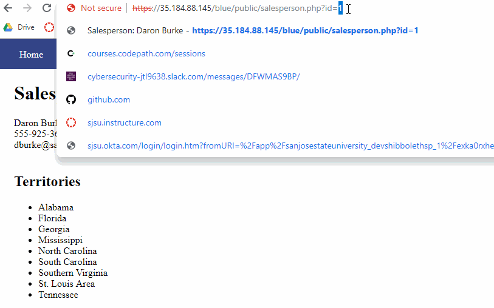
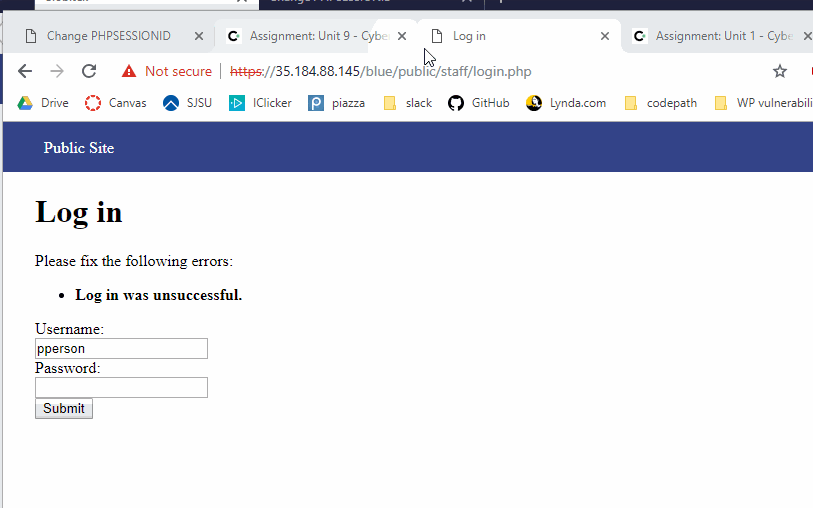
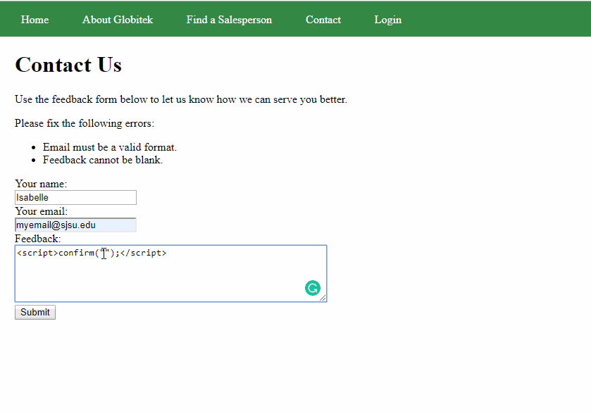
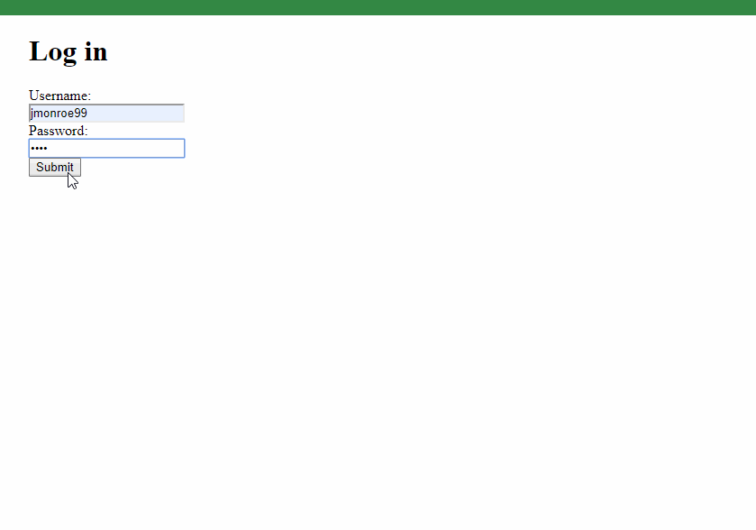
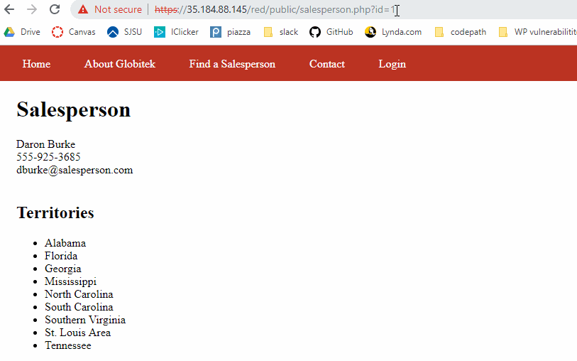
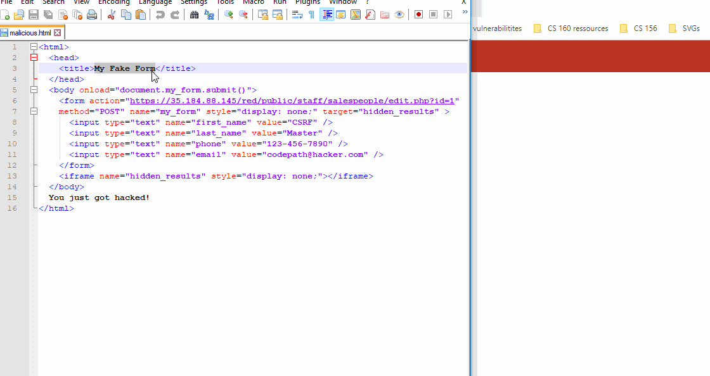

# Project 8 - Pentesting Live Targets

Time spent: **6** hours spent in total

> Objective: Identify vulnerabilities in three different versions of the Globitek website: blue, green, and red.

Each version of the site has been given two of the six vulnerabilities. (In other words, all six of the exploits should be assignable to one of the sites.)

## Blue

Vulnerability #1: SQLi

Vulnerability #2: session Hijacking

## Green

Vulnerability #1: XSS

Vulnerability #2: User Enumeration

## Red

Vulnerability #1: IDOR

Vulnerability #2: CSRF

## Notes

NA
